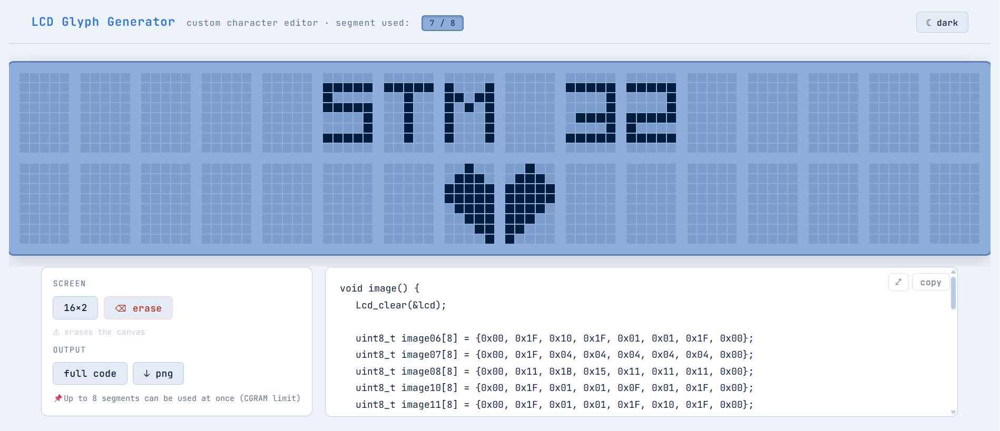
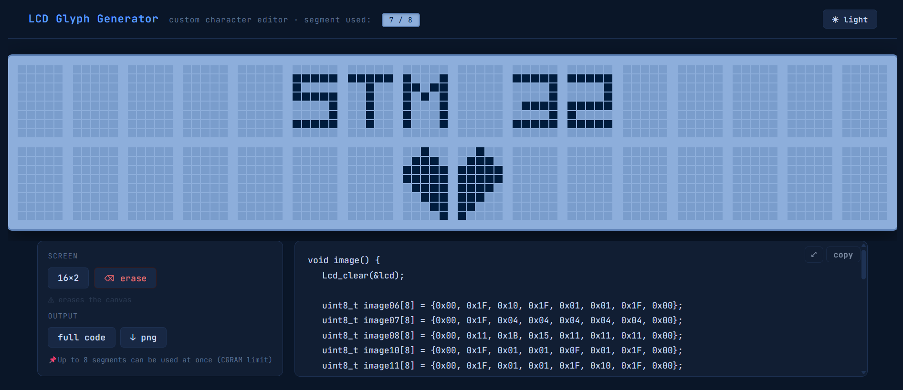

# nucleoscreen
### LCD Glyph Generator

A pixel editor for creating custom characters on **HD44780-based LCDs** using Nucleo boards.  
Generates ready-to-use **C code with hex values** for STM32 projects.

  
  

## Features

- Pixel-based editor for HD44780 based LCD 
- **Live CGRAM segment counter** (0–8 limit)
- Generate **full C code** or **function-only** output
- **One-click copy** of generated code
- **Expandable code view** for better readability
- **Export or download canvas as PNG**
- Light / Dark modern theme toggle
- Undo (ctrl+z) / Redo (ctrl+y) / Full erase options

## How to use

1. Click or drag to draw pixels
2. Watch the segment counter to stay within CGRAM limits
3. Copy or expand the generated C code
4. Optionally export the design as a PNG

## Live demo

👉 https://samiul-islam-siam.github.io/nucleoscreen/

## Library

Generated code would be used directly using this library:  
[LCD 1602 Library (Bare-Metal)](https://github.com/samiul-islam-siam/STM32-Lab/tree/Experiments/LCD%201602A%20BareMetal)